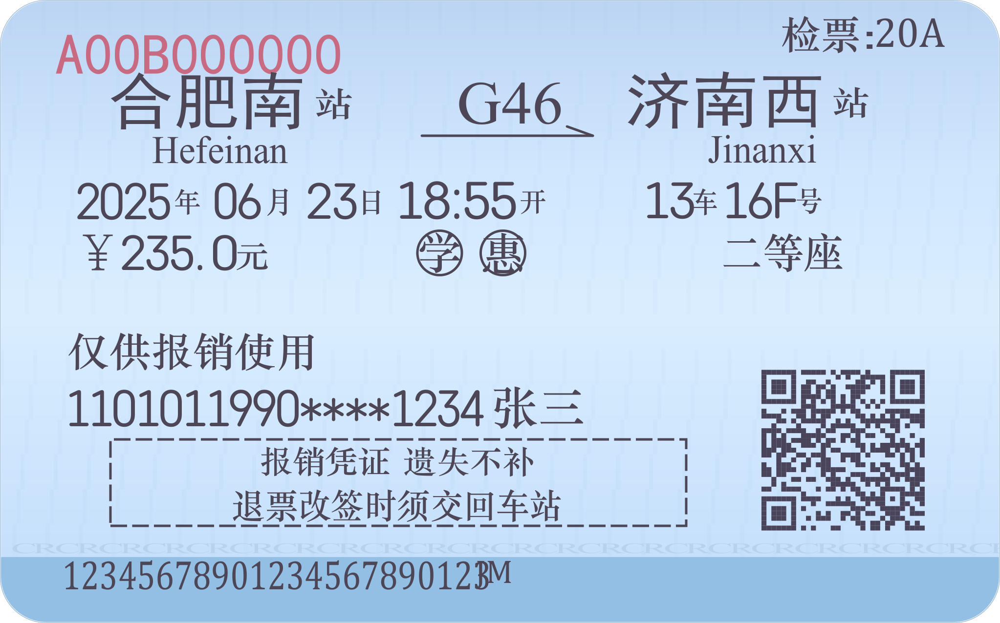

# 铁路电子客票报销凭证生成器

按参考图逐像素标定的火车票（铁路电子客票报销凭证）PDF 生成器，输出 85.6mm 宽的矢量 PDF，内置纸张纹理、CR 底纹、二维码、学/惠圆圈等细节。

> 本仓库为**脱敏版**：所有示例数据均为虚构，不含任何真实个人信息。
> 仅供学习与纪念使用，**禁止**用于伪造票据、欺诈、逃票、商用等用途。

## 预览



## 功能

- 矢量 PDF 输出（85.6mm × 53.38mm，A4 比例缩放友好），可选 PNG 预览
- 版式按参考图逐像素标定（字号 / 横向缩放 / 字距 / 位置）
- 三种数据来源：
  - 默认虚构数据
  - `--json` 从 JSON 文件读取
  - `--invoice` 从电子发票（铁路电子客票）PDF 自动解析
- 自动识别发票中的退票费并显示（"仅供报销使用"上方一行）
- 可关闭纸张纹理、可选用发票内二维码图片

## 环境依赖

- Python 3.8+
- `reportlab`（PDF 生成）
- `qrcode`（二维码）
- `Pillow`（纸张纹理 / 二维码透明化）
- `PyMuPDF`（PNG 预览渲染、发票解析）

```bash
pip install reportlab qrcode pillow pymupdf
```

## 用法

```bash
# 默认虚构数据 -> ticket.pdf
python make_ticket.py

# 指定输出并同时生成 PNG 预览
python make_ticket.py -o my.pdf --preview

# 从 JSON 读入票面字段
python make_ticket.py --json data.json

# 从电子发票 PDF 生成（支持多张/通配符），输出到指定目录
python make_ticket.py --invoice 车票/*.pdf --outdir out --preview

# 不绘制纸张纹理 / 不使用发票内二维码（改用程序生成）
python make_ticket.py --no-texture
python make_ticket.py --invoice a.pdf --no-invoice-qr
```

JSON 可用字段（与 `Ticket` 类一致）：

```json
{
  "ticket_no": "A00B000000",
  "gate": "20A",
  "from_station": "合肥南", "from_pinyin": "Hefeinan",
  "to_station": "济南西", "to_pinyin": "Jinanxi",
  "train_no": "G46", "depart": "2025-06-23 18:55",
  "coach": "13", "seat": "16F", "seat_suffix": "号",
  "price": 235.0, "seat_class": "二等座", "discount": true,
  "passenger": "张三", "id_no": "1101011990****1234",
  "serial": "12345678901234567890123", "serial_suffix": "JM"
}
```

## 字体

| 用途 | 字体 |
|---|---|
| 站名（合肥南 / 济南西） | 黑体 SimHei（标准字重） |
| 中文正文（年/月/日/开/车/号/元/检票/席别/姓名/框内文字等） | 华文中宋 STZhongsong |
| 日期 / 时间 / 座位 / 票价 / 证件号数字 | Core Sans DS 35 Regular（紧凑字距） |
| ￥ | 宋体 SimSun |
| 站名拼音 / 车次 | Times New Roman |
| 检票口 / 底部序列号 | Cambria |
| 红票号 | 黑体 SimHei |

`fonts/` 目录附带可自由分发的字体：

- **Core Sans DS 35 Regular**（S-Core）

其余字体调用系统字体（Windows 自带），非 Windows 环境会自动回退到相近字体。

### 关于数字字体

票面数字（日期 / 时间 / 座位 / 票价 / 证件号）目前使用 **Core Sans DS 35 Regular** 并收紧字距来近似原票的印刷数字，但**还没有找到真正匹配的字体**（原票数字应为铁路印刷/针式专用字体）。

如果你知道更接近的字体（自由或商用均可），欢迎提 Issue 告知，非常感谢！

## 免责声明

1. 本项目仅供学习、技术研究与个人纪念使用。
2. 严禁将生成的图片/PDF 用于任何伪造、欺诈、逃票等违法用途或商业用途。
3. 火车票样式版权归中国铁路总公司所有，本项目仅为技术学习交流。
4. 因使用本项目产生的任何法律责任由使用者自行承担。
